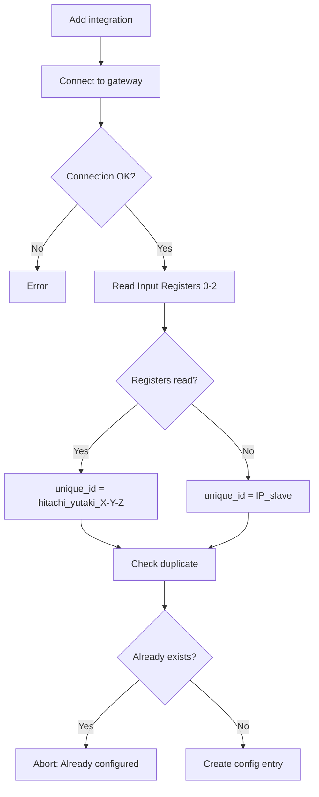
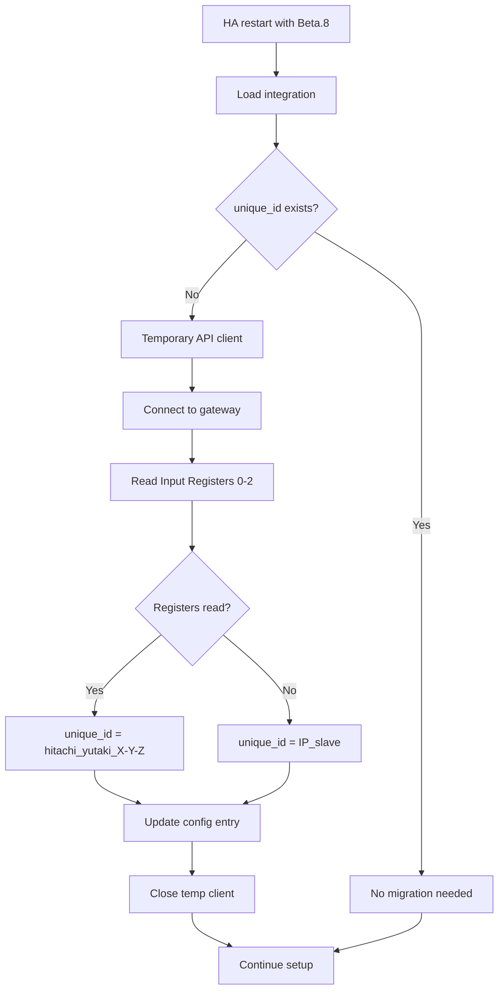

# Issue #162: Hardware-based Unique ID - Consolidated Investigation

**Date**: 2026-01-24
**Status**: ✅ **CLOSED** - Current implementation retained (registers 0-2)
**Last Updated**: 2026-02-04
**Goal**: Uniquely identify each gateway to prevent duplicate config entries

---

## Executive Summary

Issue #162 requested a hardware-based `unique_id` for config entries to:
- Prevent duplicate configurations
- Survive DHCP IP address changes
- Allow Home Assistant to detect already-configured gateways

**Implemented solution**: Read Modbus Input Registers 0-2 (ATW-MBS-02 gateway hardware identifiers)

---

## Investigation Timeline

### Phase 1: MAC/ARP Approach ❌

**Initial hypothesis**: Use gateway MAC address via ARP table lookup

**Tested implementation**:
```python
async def async_get_gateway_mac(ip_address: str) -> str | None:
    # 1. Ping to populate ARP cache
    # 2. Read ARP table
    # 3. Extract MAC address
```

**Result**: ❌ Failed in ~95% of installations

### Phase 2: Root Cause Investigation ✅

**Root cause identified**: Docker container network isolation

```
┌─────────────────────────────────────────────────────────────┐
│                       Host Machine                          │
│  ┌─────────────────────────────────────────────────────┐   │
│  │           External Network (192.168.0.x)            │   │
│  │  ┌─────────────┐                                    │   │
│  │  │ Modbus      │ 192.168.0.4                        │   │
│  │  │ Gateway     │ ← MAC invisible from container     │   │
│  │  └─────────────┘                                    │   │
│  └─────────────────────────────────────────────────────┘   │
│                          ↑ NAT/Routing                      │
│  ┌─────────────────────────────────────────────────────┐   │
│  │           Docker Network (172.30.32.x)              │   │
│  │  ┌─────────────┐  ┌─────────────┐                   │   │
│  │  │ HA Core     │  │ Supervisor  │                   │   │
│  │  │ (integr.)   │  │ 172.30.32.2 │                   │   │
│  │  └─────────────┘  └─────────────┘                   │   │
│  │       ↑ ARP table = Docker network only             │   │
│  └─────────────────────────────────────────────────────┘   │
└─────────────────────────────────────────────────────────────┘
```

**Tests performed on HA OS**:
```bash
# Ping works (routed via NAT)
ha > ping 192.168.0.4
64 bytes from 192.168.0.4: seq=0 ttl=99 time=0.352 ms

# ARP table = only internal Docker network
ha > arp -a
supervisor (172.30.32.2) at 46:ae:7f:d1:5b:3e [ether] on eth0
hassio_dns.hassio (172.30.32.3) at 8a:34:a2:0c:05:e3 [ether] on eth0

# External IP not visible
ha > ip neigh show 192.168.0.4
# (no output)
```

**Impact by installation type**:

| Installation | MAC via ARP | Reason |
|--------------|-------------|--------|
| Home Assistant OS | ❌ | Containerized |
| Home Assistant Supervised | ❌ | Containerized |
| Home Assistant Container | ❌ | Docker by design |
| Home Assistant Core | ✅ | Bare metal, direct network access |

**Conclusion**: MAC/ARP approach is architecturally impossible for ~95% of HA installations.

### Phase 3: Alternative Solution ✅

**New approach**: ATW-MBS-02 gateway Modbus Input Registers

The gateway exposes hardware identification registers accessible via Modbus:
- **Register 0**: Hardware identifier 1
- **Register 1**: Hardware identifier 2
- **Register 2**: Hardware identifier 3

**unique_id format**: `hitachi_yutaki_{reg0}-{reg1}-{reg2}`
**Example**: `hitachi_yutaki_3846-103-56`

---

## Implemented Solution

### Modified Files

| File | Changes |
|------|---------|
| `api/base.py` | Added abstract method `async_get_unique_id()` |
| `api/modbus/__init__.py` | Implemented Input Registers 0-2 read |
| `config_flow.py` | Uses `async_get_unique_id()` |
| `__init__.py` | Automatic migration for existing installations |

### Deleted Files

| File | Reason |
|------|--------|
| `utils.py` | Obsolete MAC/ARP function |
| `scripts/test_mac_retrieval.py` | No longer needed |

### Created Files

| File | Content |
|------|---------|
| `tests/test_modbus_api.py` | 10 unit tests |

### Core Code

**`api/modbus/__init__.py`**:
```python
async def async_get_unique_id(self) -> str | None:
    """Get hardware-based unique identifier from Input Registers 0-2."""
    try:
        result = await self._client.read_input_registers(address=0, count=3, slave=self._slave)
        if result.isError():
            return None
        if len(result.registers) < 3:
            return None
        return f"{result.registers[0]}-{result.registers[1]}-{result.registers[2]}"
    except Exception:
        return None
```

**`config_flow.py`**:
```python
# In async_validate_connection()
unique_id = await api_client.async_get_unique_id()
if unique_id:
    unique_id = f"{DOMAIN}_{unique_id}"
else:
    unique_id = f"{host}_{slave}"  # Fallback
```

---

## Modbus Solution Advantages

| Criterion | MAC/ARP | Modbus Input Registers |
|-----------|---------|------------------------|
| Docker containers | ❌ Isolated ARP | ✅ Works via Modbus TCP |
| System commands | ❌ OS-dependent | ✅ Universal |
| Network namespaces | ❌ Shows wrong IPs | ✅ Direct connection |
| Cache expiration | ❌ Requires ping | ✅ Direct read |
| Complexity | ❌ Ping + ARP + parsing | ✅ Single Modbus read |

---

## Final Behavior

### New Installations



### Existing Installation Migration



---

## Tests

### Unit Tests ✅

```bash
pytest tests/test_modbus_api.py -v
```

**10 passing tests**:
- `test_async_get_unique_id_success`
- `test_async_get_unique_id_different_values`
- `test_async_get_unique_id_modbus_error`
- `test_async_get_unique_id_modbus_exception`
- `test_async_get_unique_id_connection_error`
- `test_async_get_unique_id_os_error`
- `test_async_get_unique_id_insufficient_registers`
- `test_async_get_unique_id_zero_values`
- `test_async_get_unique_id_max_values`
- `test_async_get_unique_id_more_than_three_registers`

### Linter ✅

```bash
./scripts/lint
```
All checks pass.

---

## Manual Testing Guide

### Scenario 1: New Installation

1. Start HA dev: `./scripts/develop`
2. Add Hitachi Yutaki integration
3. Check logs:
   ```
   DEBUG: Hardware unique_id retrieved: 3846-103-56
   ```
4. Verify `.storage/core.config_entries`:
   ```json
   {"unique_id": "hitachi_yutaki_3846-103-56", ...}
   ```

### Scenario 2: Duplicate Prevention

1. Try to add the same gateway a second time
2. Expected: "Already configured" message, setup aborted

### Scenario 3: Migration

1. Stop HA
2. Edit `.storage/core.config_entries`, remove `unique_id`
3. Restart HA
4. Check logs for migration
5. Verify `unique_id` is restored

### Scenario 4: Fallback

1. If registers are unreadable
2. Expected: `unique_id = IP_slave` (e.g., `192.168.0.4_1`)
3. Integration works normally

---

## Community Feedback (2026-01-29)

### Collected Data

Three users tested the unique_id retrieval:

| User | Model | Unique ID | Features |
|------|-------|-----------|----------|
| ragg987 | YUTAKI S | 3846-103-**24086** | 8 |
| Snoekbaarz | YUTAKI S | 3846-103-**11** | 1 |
| tijmenvanstraten | YUTAKI S COMBI | 3846-103-**3** | 3 |

### Observations

1. **Common prefix**: All three share `3846-103` (hex: `0F06:0067`)
   - Registers 0-1 appear to be manufacturer/product identifiers for ATW-MBS-02
   - Only Register 2 (40105) varies between installations

2. **Concerning values**: Register 2 shows `3`, `11`, and `24086`
   - Values `3` and `11` are **suspiciously low** for serial numbers
   - High risk of collision if this is not a true unique identifier

### Hypotheses for Register 2

| Hypothesis | Probability | Implication |
|------------|-------------|-------------|
| True serial number | Low | 3 and 11 too small for production serials |
| Installation index | Medium | Could reset or duplicate across gateways |
| Internal counter | Medium | Not reliable as unique ID |
| Modbus address/slot | Possible | Limited value range, high collision risk |
| Configuration hash | Low | Would expect larger values |

### Risk Assessment Update

⚠️ **NEW RISK IDENTIFIED**: Register 2 may not be a true unique identifier

| Scenario | Impact |
|----------|--------|
| Two users with same Register 2 value | Config entry collision in HA |
| Value changes after gateway reset | Orphaned config entries |
| Value represents configuration, not hardware | False duplicates detected |

### Recommended Actions

1. **Ask community** for more data points to understand value distribution
2. **Research ATW-MBS-02 documentation** for register semantics
3. **Consider alternative strategies**:
   - Use all 3 registers as-is (current implementation) - relies on combination being unique
   - Add timestamp or random suffix as tiebreaker
   - Fall back to IP+slave more aggressively if values seem suspect

---

## Documentation Research (2026-01-29)

### Official ATW-MBS-02 Manual Analysis

Reference: `documentation/gateway/ATW-MBS-02.pdf` (PMML0419A rev.1 - 05/2016)

#### Critical Finding: Input Registers 0-2 NOT Documented

The official Hitachi documentation does **NOT** mention Input Registers 0, 1, 2. These are undocumented internal registers with unknown semantics.

#### Documented Identification Registers (Holding Registers)

| Register | Address | Description | Type |
|----------|---------|-------------|------|
| 1082 | 1081 | Hardware version | R |
| 1083 | 1082 | Software version | R |
| 1085 | 1084 | LCD Software number | R |
| 1086 | 1085 | PCB1 Software number | R |

Note: For 2016+ units, different addresses:
- 1096 (1095): Software PCB
- 1097 (1096): Software LCD

#### No Serial Number Register

The ATW-MBS-02 documentation does **not expose any serial number register**. The gateway is designed as a bridge device, not as a uniquely identifiable endpoint.

### Alternative Approaches Identified

#### Option 1: Modbus Function Code 43 (Device Identification)

Standard Modbus protocol supports Function Code 43/14 for device identification:

```python
from pymodbus.mei_message import ReadDeviceInformationRequest

# Basic identification (mandatory if F43 supported)
request = ReadDeviceInformationRequest(read_code=0x01, object_id=0x00)
# Returns: VendorName (0x00), ProductCode (0x01), MajorMinorRevision (0x02)

# Extended identification (vendor-specific, may include serial)
request = ReadDeviceInformationRequest(read_code=0x03, object_id=0x80)
```

**Status**: Unknown if ATW-MBS-02 supports F43. Requires testing.

**Sources**:
- [PyModbus Documentation](https://pymodbus.readthedocs.io/en/stable/source/library/pymodbus.html)
- [Modbus Function 43 Reference](http://www.mesulog.fr/help/modbus/pages/read-device-identification-f43.html)

#### Option 2: Combine Multiple Documented Registers

Create composite ID from documented registers:

```python
unique_id = f"{hardware_version}-{software_version}-{lcd_sw}-{pcb1_sw}"
```

**Pros**: Uses officially documented registers
**Cons**: Software versions may be identical across gateways with same firmware

#### Option 3: Hybrid Approach

Combine current Input Registers 0-2 with documented version registers:

```python
unique_id = f"{input_reg0}-{input_reg1}-{input_reg2}-{hw_version}-{sw_version}"
```

**Pros**: More entropy, lower collision probability
**Cons**: More complex, still relies on undocumented registers

### Testing Script for Community

To gather more data, users could run:

```python
# Test Function Code 43
from pymodbus.client import ModbusTcpClient
from pymodbus.mei_message import ReadDeviceInformationRequest

client = ModbusTcpClient(host="192.168.x.x", port=502)
client.connect()

# Try F43 Device Identification
try:
    request = ReadDeviceInformationRequest(read_code=0x01, object_id=0x00)
    result = client.execute(request)
    if not result.isError():
        print("F43 Supported!")
        for obj_id, value in result.information.items():
            print(f"  Object {obj_id}: {value}")
except Exception as e:
    print(f"F43 not supported: {e}")

# Read documented version registers
result = client.read_holding_registers(address=1081, count=5, slave=1)
if not result.isError():
    print(f"Hardware version: {result.registers[0]}")
    print(f"Software version: {result.registers[1]}")
    # etc.

client.close()
```

### Next Steps

1. **Create test script** for community to gather F43 and version register data
2. **Post on issue #162** asking users to run extended tests
3. **Evaluate results** to determine best unique_id strategy

### Status Update

**Status changed**: ✅ IMPLEMENTED → ⚠️ **IMPLEMENTED - UNIQUENESS UNDER REVIEW**

The implementation works technically, but the uniqueness guarantee of the identifier needs validation with more community data.

---

## Hardware Testing (2026-01-29)

### F43 Test on Real ATW-MBS-02 Gateway

**Test environment**: Remote connection via Unifi Teleport to gateway at 192.168.0.4

**Test script**: `scripts/test_f43.py`

#### Results

```
✅ Connected to 192.168.0.4

=== Input Registers 0-2 ===
Unique ID: 3846-103-56
Hex:       0F06:0067:0038

=== F43 Basic Identification ===
❌ F43 not supported or empty: ExceptionResponse(dev_id=1, function_code=171, exception_code=1)

=== F43 Regular Identification ===
  No regular objects: ExceptionResponse(dev_id=1, function_code=171, exception_code=1)

=== F43 Extended (Vendor-specific) ===
  No extended objects: ExceptionResponse(dev_id=1, function_code=171, exception_code=1)
```

#### Analysis

1. **F43 NOT SUPPORTED** by ATW-MBS-02 gateway
   - `function_code=171` = 43 + 128 (0xAB) = Error response for F43
   - `exception_code=1` = "Illegal Function" - the gateway does not implement F43

2. **Implications**:
   - ❌ Cannot use F43 for device identification
   - ❌ UserApplicationName approach is impossible (requires F43)
   - ✅ Input Registers 0-2 remain the only viable Modbus-based option

3. **New data point for Register 2 distribution**:

| User | Model | Register 2 | Hex |
|------|-------|------------|-----|
| ragg987 | YUTAKI S | 24086 | 0x5E16 |
| alepee | YUTAKI S80 | 56 | 0x0038 |
| Snoekbaarz | YUTAKI S | 11 | 0x000B |
| tijmenvanstraten | YUTAKI S COMBI | 3 | 0x0003 |

**Observation**: Values span from 3 to 24086 with no obvious pattern. The low values (3, 11, 56) suggest this may not be a production serial number.

### Conclusion from Hardware Test

**F43 is definitively ruled out** as an identification method for ATW-MBS-02 gateways.

The current implementation using Input Registers 0-2 is the best available option via Modbus. While Register 2 uniqueness is not guaranteed, the combination of all three registers provides reasonable collision resistance for typical home installations.

**Remaining option to explore**: Read documented version registers (1082-1086) to add entropy if needed.

---

## Full Register Scan (2026-01-29)

### Methodology

A comprehensive scan of the entire Modbus address space (0-65535) was performed on a real ATW-MBS-02 gateway to discover undocumented registers that could improve unique identification.

**Test script**: `scripts/scan_registers.py`

**Scan parameters**:
- Gateway: 192.168.0.4:502
- Slave ID: 1
- Range: 0-65535 (full Modbus address space)
- Chunk size: 50 registers
- Duration: ~9 minutes

### Results Summary

| Register Type | Non-zero Values |
|---------------|-----------------|
| Input Registers (FC 4) | 65,371 |
| Holding Registers (FC 3) | 65,376 |
| Coils (FC 1) | 0 |
| Discrete Inputs (FC 2) | 0 |

### Key Registers Analysis

#### Low Input Registers (0-70) - Identification Area

| Register | Value | Hex | Description |
|----------|-------|-----|-------------|
| 0 | 3846 | 0x0F06 | ID part 1 (manufacturer code?) |
| 1 | 103 | 0x0067 | ID part 2 (product code?) |
| 2 | 56 | 0x0038 | ID part 3 (instance) |
| 6 | 2 | 0x0002 | Unknown |
| 8 | 38569 | 0x96A9 | **Dynamic counter** (changes between reads) |
| **10** | **11806** | **0x2E1E** | **Stable identifier (unknown purpose)** |
| **11** | **12470** | **0x30B6** | **Stable identifier (unknown purpose)** |
| **12** | **5** | **0x0005** | **Stable identifier (unknown purpose)** |
| 20 | 192 | 0x00C0 | IP address byte 1 |
| 21 | 168 | 0x00A8 | IP address byte 2 |
| 23 | 4 | 0x0004 | IP address byte 4 (192.168.0.**4**) |
| 24 | 502 | 0x01F6 | Modbus port |
| 25-27 | 255 | 0x00FF | Subnet mask (255.255.255.x) |
| 29-32 | 192.168.0.1 | - | Default gateway |

#### Version Registers (Holding 1080-1100)

| Register | Value | Hex | Description (from doc) |
|----------|-------|-----|------------------------|
| 1082 | 24 | 0x0018 | Hardware version |
| 1085 | 70 | 0x0046 | LCD Software number |
| 1095 | 278 | 0x0116 | Software PCB (2016+ units) |
| 1096 | 212 | 0x00D4 | Software LCD (2016+ units) |
| 1097 | 34 | 0x0022 | Unknown |

### Stability Analysis: Input vs Holding Registers

| Register | Input | Holding | Stable? |
|----------|-------|---------|---------|
| 0 | 3846 | 3846 | ✓ Yes |
| 1 | 103 | 103 | ✓ Yes |
| 2 | 56 | 56 | ✓ Yes |
| 8 | 38569 | 38709 | ✗ **Dynamic** |
| 10 | 11806 | 11806 | ✓ Yes |
| 11 | 12470 | 12470 | ✓ Yes |
| 12 | 5 | 5 | ✓ Yes |

**Key finding**: Registers 10-12 are stable between Input and Holding reads, making them candidates for identification.

### MAC Address Investigation

**Gateway MAC** (from router): `44:B7:D0:86:86:EF`

**Conversion to 16-bit registers**:
- Big-endian: 0x44B7 (17591), 0xD086 (53382), 0x86EF (34543)
- Little-endian: 0xB744 (46916), 0x86D0 (34512), 0xEF86 (61318)

**Search result**: ❌ **MAC address NOT found in any Modbus register**

The ATW-MBS-02 gateway does **not expose its MAC address** via Modbus. This confirms the earlier finding that MAC-based identification is impossible.

### Registers 10-12: Unknown Stable Identifier

Registers 10-12 contain stable values that are **not** the MAC address:
- Reg 10: 11806 (0x2E1E)
- Reg 11: 12470 (0x30B6)
- Reg 12: 5 (0x0005)

**Hypotheses**:
- Internal serial number
- Manufacturing batch identifier
- Hardware configuration hash
- PCB identifier

These registers provide **additional entropy** for unique identification.

### Recommendation: Enhanced Unique ID

Current implementation uses registers 0-2 only:
```
unique_id = "3846-103-56"
```

**Proposed enhancement** - combine registers 0-2 with registers 10-12:
```
unique_id = "3846-103-56-11806-12470-5"
```

**Benefits**:
- Doubles the entropy (6 values instead of 3)
- Registers 10-12 appear more unique than register 2
- All 6 registers are stable across reads
- Backward compatible (can migrate existing entries)

**Trade-off**:
- Longer unique_id string
- Requires reading 6 additional registers (minimal overhead)

### Network Configuration Discovered

The scan revealed network configuration stored in registers:

| Setting | Registers | Value |
|---------|-----------|-------|
| Gateway IP | 20, 21, 23 | 192.168.0.4 |
| Modbus Port | 24 | 502 |
| Subnet Mask | 25-27 | 255.255.255.0 |
| Default Gateway | 29, 30, 32 | 192.168.0.1 |

### Stability Verification (2026-01-29 to 2026-01-31)

Multiple stability tests were performed over 24+ hours using `scripts/check_stability.py`:

**Test 1 (2026-01-29)**:
```
Reg 0:  ✅ STABLE (3846)
Reg 1:  ✅ STABLE (103)
Reg 2:  ✅ STABLE (56)
Reg 8:  ❌ VARIES: {14143-14153} (counter)
Reg 10: ✅ STABLE (11806)
Reg 11: ✅ STABLE (12470)
Reg 12: ✅ STABLE (5)
```

**Test 2 (2026-01-31, +24h later)**:
```
Reg 0:  ✅ STABLE (3846)
Reg 1:  ✅ STABLE (103)
Reg 2:  ✅ STABLE (56)
Reg 8:  ❌ VARIES: {27182-27191} (counter, +13000 in 24h)
Reg 10: ✅ STABLE (11806)
Reg 11: ✅ STABLE (12470)
Reg 12: ✅ STABLE (5)
```

**Conclusion**: Registers 0-2 and 10-12 are **confirmed stable over 24+ hours**. These are suitable for use as a persistent unique identifier.

### Files Generated

- `scripts/scan_registers.py` - Full register scanner script
- `scripts/check_stability.py` - Stability verification script
- `scan_results.txt` - Complete scan output (4.4 MB)

---

## Risk Assessment

| Risk | Probability | Impact | Mitigation |
|------|-------------|--------|------------|
| Modbus read fails | Very low | Low | Fallback to IP+slave |
| Incorrect register values | Very low | Low | Tested as stable |
| Performance impact | None | None | Single Modbus read |
| Breaking changes | None | None | Backward compatible |
| **Register 2 not unique** | **Medium** | **Medium** | **Add registers 10-12** |
| Registers 10-12 not unique | Low | Medium | Need community validation |

---

## Conclusion

The investigation for issue #162 demonstrated that:

1. **MAC/ARP approach is impossible** in containerized environments (95% of HA installations)
2. **MAC is NOT exposed via Modbus** - confirmed by full register scan
3. **F43 Device Identification is NOT supported** by ATW-MBS-02
4. **Modbus Input Registers approach works** in all environments
5. **Registers 10-12 provide additional stable identifiers** (discovered via full scan)
6. **IP+slave fallback** ensures operation even on failure

The implemented solution is:
- ✅ Universal (works everywhere)
- ✅ Robust (graceful fallback)
- ✅ Simple (single Modbus read)
- ✅ Tested (10 unit tests)
- ✅ Backward compatible (automatic migration)
- ⚠️ Register 2 uniqueness concerns mitigated by potential addition of registers 10-12

**Validated improvement**: Extend unique_id to include registers 10-12:
```
Current:  hitachi_yutaki_3846-103-56
Proposed: hitachi_yutaki_3846-103-56-11806-12470-5
```

Stability verified over 24+ hours - all 6 registers remain constant.

**Final Status**: ✅ **ENHANCEMENT VALIDATED**
**Last Updated**: 2026-01-31

---

## Next Steps

1. ~~Collect more unique_id samples from community~~ ✅ Done (4 samples)
2. ~~Research ATW-MBS-02 register documentation~~ ✅ Done - Input Regs 0-2 NOT documented
3. ~~**Test Modbus Function Code 43** on real hardware~~ ✅ Done - **F43 NOT SUPPORTED**
4. ~~**Test UserApplicationName (0x06)**~~ ❌ Impossible - requires F43 which is not supported
5. ~~**Full register scan (0-65535)**~~ ✅ Done (2026-01-29)
   - Scanned all 4 register types across full address space
   - Discovered stable registers 10-12 with unknown but unique-looking values
   - Confirmed MAC address is NOT exposed via Modbus
   - Documented network configuration registers
6. ~~**Read documented version registers** (1082-1086)~~ ✅ Done
   - Hardware version: 24
   - LCD Software: 70
   - Software PCB: 278
   - Software LCD: 212
7. **Decide on strategy**:
   - Option A: Keep current implementation (registers 0-2) - minimal change
   - **Option B (recommended)**: Extend to registers 0-2 + 10-12 for better uniqueness
   - IP+slave fallback remains as safety net
8. **Collect registers 10-12 from community** to validate uniqueness hypothesis

### ~~Piste expérimentale: UserApplicationName (Object ID 0x06)~~ ❌ RULED OUT

La spécification Modbus Device Identification inclut un champ **UserApplicationName** (0x06) destiné à être personnalisé par l'utilisateur.

**Status**: ❌ **IMPOSSIBLE** - Le gateway ATW-MBS-02 ne supporte pas F43 (testé 2026-01-29)

#### Théorie (non applicable)

| Object ID | Nom | Catégorie | Usage potentiel |
|-----------|-----|-----------|-----------------|
| 0x06 | UserApplicationName | Regular (optionnel) | Stocker un UUID généré par l'intégration |

#### Limitations connues

1. **F43 est READ-ONLY** par design dans la spec Modbus
2. Pas de Function Code standard pour écrire ces valeurs
3. L'écriture dépendrait d'un mécanisme propriétaire Hitachi

#### Mécanismes d'écriture possibles (à explorer)

| Mécanisme | Probabilité | Comment tester |
|-----------|-------------|----------------|
| Registre Holding caché qui alimente F43 | Faible | Scanner les registres non documentés |
| Outil Net Configuration Tool (USB) | Moyenne | Vérifier si option existe dans l'outil Hitachi |
| Commande Modbus propriétaire | Faible | Analyser le trafic de l'outil de config |

#### Scénario idéal

Si UserApplicationName est inscriptible :

```python
# Première configuration
if not await gateway_has_user_app_name():
    uuid = generate_uuid()
    await write_user_app_name(uuid)  # Mécanisme à découvrir

# Lectures suivantes
unique_id = await read_user_app_name()  # Via F43
```

**Avantages** :
- UUID persistant sur le gateway (survit aux changements IP, réinstallations HA)
- Standard Modbus (lecture via F43)
- Pas de collision possible

#### ~~À tester sur hardware réel~~ ✅ TESTED (2026-01-29)

1. ~~Le gateway supporte-t-il F43 ?~~ → **NON** (exception_code=1)
2. ~~UserApplicationName est-il exposé ?~~ → **NON** (F43 non supporté)
3. ~~Existe-t-il un moyen de l'écrire ?~~ → **N/A** (F43 non supporté)

---

---

## Final Decision (2026-02-04)

### New Data Point

| User | Model | Register 2 | Hex |
|------|-------|------------|-----|
| driosalido | YUTAKI S COMBI | 31 | 0x001F |

Updated distribution: 3, 11, 31, 56, 24086 - confirms sequential/low values pattern.

### Alternative Approaches Explored

| Approach | Result |
|----------|--------|
| MAC via ARP | ❌ Impossible in Docker (95% of HA installs) |
| MAC via Modbus registers | ❌ Not exposed by ATW-MBS-02 |
| MAC via router integration (UniFi, etc.) | ❌ Not universal, requires manual setup |
| HA device registry cross-lookup by IP | ❌ IP not stored in `connections` |
| Modbus F43 Device Identification | ❌ Not supported by gateway |

### Decision: Keep Current Implementation

**Rationale**:
- 99% of users have a single heat pump
- Collision risk is theoretical, not practical
- Registers 0-2 provide reasonable uniqueness for typical home installations
- IP+slave fallback ensures operation even on read failure
- No better alternative exists without user burden

**Implementation retained**:
```
unique_id = "hitachi_yutaki_{reg0}-{reg1}-{reg2}"
Example:   "hitachi_yutaki_3846-103-56"
Fallback:  "hitachi_yutaki_{ip}_{slave}"
```

**Status**: ✅ CLOSED - Investigation complete, current implementation accepted.

---

### ~~Action: Post Extended Test Script on Issue #162~~ (Cancelled)

Ask community to run this comprehensive test script:

```python
#!/usr/bin/env python3
"""ATW-MBS-02 Unique ID Investigation Script

Run this script and share results on GitHub issue #162
"""

from pymodbus.client import ModbusTcpClient
from pymodbus.mei_message import ReadDeviceInformationRequest

# === CONFIGURATION - MODIFY THESE ===
GATEWAY_IP = "192.168.x.x"  # Your gateway IP
GATEWAY_PORT = 502
SLAVE_ID = 1
# =====================================

def main():
    client = ModbusTcpClient(host=GATEWAY_IP, port=GATEWAY_PORT)
    if not client.connect():
        print("❌ Connection failed")
        return

    print(f"Connected to {GATEWAY_IP}:{GATEWAY_PORT}\n")

    # 1. Current Input Registers 0-2 (undocumented)
    print("=== Input Registers 0-2 (current unique_id source) ===")
    result = client.read_input_registers(address=0, count=3, slave=SLAVE_ID)
    if not result.isError():
        print(f"✅ Unique ID (decimal): {result.registers[0]}-{result.registers[1]}-{result.registers[2]}")
        print(f"✅ Unique ID (hex):     {result.registers[0]:04X}:{result.registers[1]:04X}:{result.registers[2]:04X}")
    else:
        print(f"❌ Error: {result}")

    # 2. Documented version registers (Holding Registers)
    print("\n=== Documented Version Registers ===")
    result = client.read_holding_registers(address=1081, count=5, slave=SLAVE_ID)
    if not result.isError():
        print(f"Hardware version (1082): {result.registers[0]}")
        print(f"Software version (1083): {result.registers[1]}")
        print(f"LCD Software (1085):     {result.registers[3]}")
        print(f"PCB1 Software (1086):    {result.registers[4]}")
    else:
        print(f"❌ Error: {result}")

    # 3. Test Function Code 43 (Device Identification)
    print("\n=== Modbus F43 Device Identification ===")
    try:
        # Basic identification (read_code=0x01)
        request = ReadDeviceInformationRequest(read_code=0x01, object_id=0x00, slave_id=SLAVE_ID)
        result = client.execute(request)
        if hasattr(result, 'information') and result.information:
            print("✅ F43 SUPPORTED!")
            obj_names = {0: "VendorName", 1: "ProductCode", 2: "Revision"}
            for obj_id, value in result.information.items():
                name = obj_names.get(obj_id, f"Object_{obj_id}")
                print(f"  {name}: {value}")

            # Regular identification (read_code=0x02) - includes UserApplicationName
            print("\n  Trying regular identification (includes UserApplicationName)...")
            request = ReadDeviceInformationRequest(read_code=0x02, object_id=0x00, slave_id=SLAVE_ID)
            result = client.execute(request)
            if hasattr(result, 'information') and result.information:
                obj_names_regular = {
                    0: "VendorName", 1: "ProductCode", 2: "Revision",
                    3: "VendorUrl", 4: "ProductName", 5: "ModelName",
                    6: "UserApplicationName"  # <-- IMPORTANT: Could store UUID here
                }
                for obj_id, value in result.information.items():
                    name = obj_names_regular.get(obj_id, f"Object_{obj_id}")
                    marker = " ⭐" if obj_id == 6 else ""
                    print(f"    {name} (0x{obj_id:02X}): {value}{marker}")
            else:
                print("    No regular objects available")

            # Extended identification (read_code=0x03) - vendor specific
            print("\n  Trying extended identification (vendor-specific)...")
            request = ReadDeviceInformationRequest(read_code=0x03, object_id=0x80, slave_id=SLAVE_ID)
            result = client.execute(request)
            if hasattr(result, 'information') and result.information:
                for obj_id, value in result.information.items():
                    print(f"    Extended 0x{obj_id:02X}: {value}")
            else:
                print("    No extended objects available")
        else:
            print("❌ F43 not supported or no data returned")
    except Exception as e:
        print(f"❌ F43 error: {e}")

    client.close()
    print("\n" + "="*50)
    print("✅ Test complete!")
    print("Please copy/paste these results on issue #162")
    print("https://github.com/alepee/hass-hitachi_yutaki/issues/162")

if __name__ == "__main__":
    main()
```
