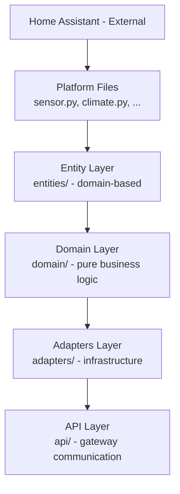

# Architecture

## Overview

The Hitachi Yutaki integration follows **Hexagonal Architecture** (Ports and Adapters) with a strict separation between pure business logic, infrastructure adapters, and Home Assistant entity registration. Entities are organized by **business domain** (e.g., circuit, DHW, compressor) rather than by HA entity type. Each architectural layer has explicit import rules enforced by convention: the domain layer depends on nothing external, adapters implement domain ports, and entities wire everything together for Home Assistant.

## Layer Diagram



## Repository Structure

```
custom_components/hitachi_yutaki/
|
|-- domain/                      # Pure business logic (NO HA dependencies)
|   |-- models/                  # Data structures (dataclasses, NamedTuples)
|   |-- ports/                   # Interfaces (Protocols) defining contracts
|   +-- services/                # Business logic services
|       |-- cop.py               # COP calculation
|       |-- electrical.py        # Electrical power calculation
|       |-- timing.py            # Compressor timing
|       |-- defrost_guard.py     # Defrost cycle filtering
|       +-- thermal/             # Thermal energy (sub-package)
|           |-- calculators.py   # Pure thermal calculation functions
|           |-- accumulator.py   # Thermal energy accumulation
|           |-- service.py       # Thermal power service
|           +-- constants.py     # Thermal constants
|
|-- adapters/                    # Concrete implementations of domain ports
|   |-- calculators/             # Power calculation adapters
|   |-- providers/               # Data providers (coordinator, entity state)
|   +-- storage/                 # Storage implementations (in-memory)
|
|-- entities/                    # Domain-driven entity organization
|   |-- base/                    # Base classes for all entity types
|   |-- performance/             # COP sensors
|   |-- thermal/                 # Thermal energy sensors
|   |-- power/                   # Electrical power sensors
|   |-- gateway/                 # Gateway connectivity sensors
|   |-- hydraulic/               # Water pumps and hydraulic sensors
|   |-- compressor/              # Compressor sensors
|   |-- control_unit/            # Main control unit entities
|   |-- circuit/                 # Heating/cooling circuit entities (climate)
|   |-- dhw/                     # Domestic Hot Water entities (water_heater)
|   +-- pool/                    # Pool heating entities
|
|-- api/                         # Modbus communication layer
|   +-- modbus/registers/        # Register definitions (ATW-MBS-02)
|
|-- profiles/                    # Heat pump model profiles (Yutaki S, S80, M, ...)
|
|-- sensor.py                    # HA platform orchestrator
|-- binary_sensor.py             # HA platform orchestrator
|-- switch.py                    # HA platform orchestrator
|-- number.py                    # HA platform orchestrator
|-- climate.py                   # HA platform orchestrator
|-- water_heater.py              # HA platform orchestrator
|-- select.py                    # HA platform orchestrator
+-- button.py                    # HA platform orchestrator
```

## Domain Layer

**Location:** `domain/`

The domain layer contains pure business logic. It is completely independent of Home Assistant and can be tested with no external dependencies or mocks.

### Structure

- **`models/`** -- Pure data models: `COPInput`, `COPQuality`, `PowerMeasurement`, `ThermalPowerInput`, `ThermalEnergyResult`, `CompressorTimingResult`, `ElectricalPowerInput`.
- **`ports/`** -- Interfaces defined as Python `Protocol` classes: `ThermalPowerCalculator`, `ElectricalPowerCalculator`, `DataProvider`, `StateProvider`, `Storage[T]`.
- **`services/`** -- Business logic services listed below.

### Key Services

| Service | File | Responsibility |
|---------|------|----------------|
| COP | `services/cop.py` | Coefficient of Performance calculation with quality indicators and energy accumulation |
| Thermal | `services/thermal/` | Thermal power calculation, energy accumulation, heating/cooling separation |
| Electrical | `services/electrical.py` | Electrical power calculation from current and voltage |
| Timing | `services/timing.py` | Compressor run-time tracking and cycle history |
| Defrost guard | `services/defrost_guard.py` | Filters defrost cycles and post-cycle thermal inertia from measurements |

### Strict Rules

1. **NEVER** import `homeassistant.*`.
2. **NEVER** import from `adapters.*` or `entities.*`.
3. **NEVER** use external libraries -- Python standard library only.
4. **ALWAYS** use `Protocol` classes to declare dependencies.
5. All public functions must have type hints and docstrings.

See [Domain Services Reference](reference/domain-services.md) for details.

## Adapters Layer

**Location:** `adapters/`

Adapters are the concrete implementations of the ports defined in the domain. They bridge the gap between pure business logic and Home Assistant infrastructure, handling HA-specific concerns such as state retrieval and error handling.

### Structure

- **`calculators/`** -- `ElectricalPowerCalculatorAdapter` (retrieves voltage/power from HA entities, delegates to `domain.services.electrical`), `thermal_power_calculator_wrapper` (adapts signature for `COPService`).
- **`providers/`** -- `CoordinatorDataProvider` (implements `DataProvider`, reads from the coordinator cache), `EntityStateProvider` (implements `StateProvider`, reads HA entity states).
- **`storage/`** -- `InMemoryStorage[T]` (implements `Storage[T]` using `collections.deque`).

### Rules

1. Always implement a domain protocol.
2. Never expose business logic -- delegate calculations to domain services.
3. Handle HA-specific errors (`unknown`, `unavailable` states) before passing data to the domain.

## Entity Layer

**Location:** `entities/`

Entities are organized by **business domain**, not by HA entity type. Each domain subfolder contains builder functions that produce lists of HA entities, and the platform orchestrator files call those builders.

### Business Domains (11)

| Domain | Responsibility |
|--------|----------------|
| `gateway` | Communication gateway monitoring |
| `hydraulic` | Water pumps, flow, water temperatures |
| `compressor` | Primary and secondary compressor state |
| `control_unit` | Outdoor unit, diagnostics, global settings |
| `circuit` | Heating/cooling zones (climate entities) |
| `dhw` | Domestic hot water (water_heater entity) |
| `pool` | Pool heating |
| `performance` | COP calculation sensors |
| `thermal` | Thermal energy production sensors |
| `power` | Electrical power consumption sensors |

### Builder Pattern

Each domain exposes one or more builder functions following a consistent signature:

```python
# entities/<domain>/sensors.py
def build_<domain>_sensors(
    coordinator: HitachiYutakiDataCoordinator,
    entry_id: str,
    # domain-specific params (circuit_id, compressor_id, ...)
) -> list[SensorEntity]:
    descriptions = _build_<domain>_sensor_descriptions()
    from ..base.sensor import _create_sensors
    return _create_sensors(coordinator, entry_id, descriptions, DEVICE_TYPE)
```

The `_create_sensors` (and equivalent functions for other entity types) factory in `entities/base/` handles conditional creation: each entity description can carry a `condition` callback that is evaluated against the coordinator to decide whether the entity should be instantiated.

### Base Classes

`entities/base/` provides one module per HA entity type, each containing:

- An entity description dataclass (e.g., `HitachiYutakiSensorEntityDescription`)
- An entity class (e.g., `HitachiYutakiSensor`)
- A factory function (e.g., `_create_sensors()`)

Supported types: `sensor`, `binary_sensor`, `switch`, `number`, `select`, `button`, `climate`, `water_heater`.

See [Entity Patterns Reference](reference/entity-patterns.md) for patterns.

## Platform Layer

**Location:** Root-level files (`sensor.py`, `binary_sensor.py`, `switch.py`, `number.py`, `select.py`, `button.py`, `climate.py`, `water_heater.py`)

Each platform file implements `async_setup_entry()` as required by Home Assistant. Its only job is to import builders from the relevant domains, call them, and register the returned entities:

```python
async def async_setup_entry(hass, entry, async_add_entities):
    coordinator = hass.data[DOMAIN][entry.entry_id]
    entities = []
    entities.extend(build_gateway_sensors(coordinator, entry.entry_id))
    entities.extend(build_performance_sensors(coordinator, entry.entry_id))
    # ... other domains
    async_add_entities(entities)
```

Platform files contain no business logic.

## API Layer

**Location:** `api/`

The API layer handles Modbus communication with the ATW-MBS-02 gateway. Register definitions live in `api/modbus/registers/`. The gateway exposes two register ranges:

- **CONTROL** (read/write) -- commands sent to the heat pump.
- **STATUS** (read-only) -- actual state reported by the heat pump.

Sensor entities must always read from STATUS registers. Reading CONTROL registers only reflects what was last commanded, not the current running state.

See [API Layer & Data Keys](development/api-data-keys.md).

## Data Flow

Data moves through the layers in a single direction during each polling cycle. The Modbus client in the API layer reads registers from the ATW-MBS-02 gateway. The coordinator (`coordinator.py`) caches the raw register values in `coordinator.data`. Domain services -- instantiated with adapter-provided dependencies -- consume that cached data through the `DataProvider` and `StateProvider` ports to compute derived values (COP, thermal energy, electrical power). Entity classes read either raw register values or computed service results and expose them as Home Assistant state. The full path is:

Modbus registers --> API client --> Coordinator cache --> Domain services --> Entity classes --> HA state machine

## Domain-to-Entity Matrix

| Domain | Sensor | Binary Sensor | Switch | Number | Climate | Water Heater | Select | Button |
|--------|--------|---------------|--------|--------|---------|--------------|--------|--------|
| gateway | x | x | | | | | | |
| hydraulic | x | x | | | | | | |
| compressor | x | x | | | | | | |
| control_unit | x | x | x | | | | x | |
| circuit | x | | x | x | x | | x | |
| dhw | x | x | x | x | | x | | x |
| pool | x | | x | x | | | | |
| performance | x | | | | | | | |
| thermal | x | | | | | | | |
| power | x | | | | | | | |
