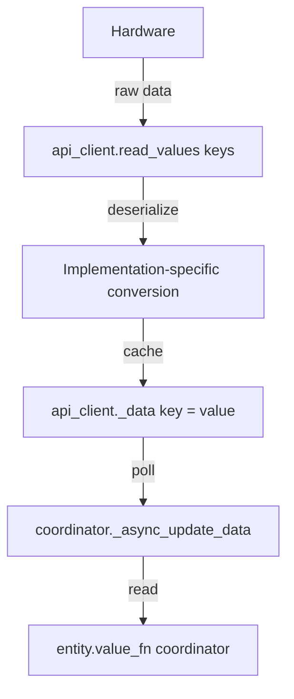
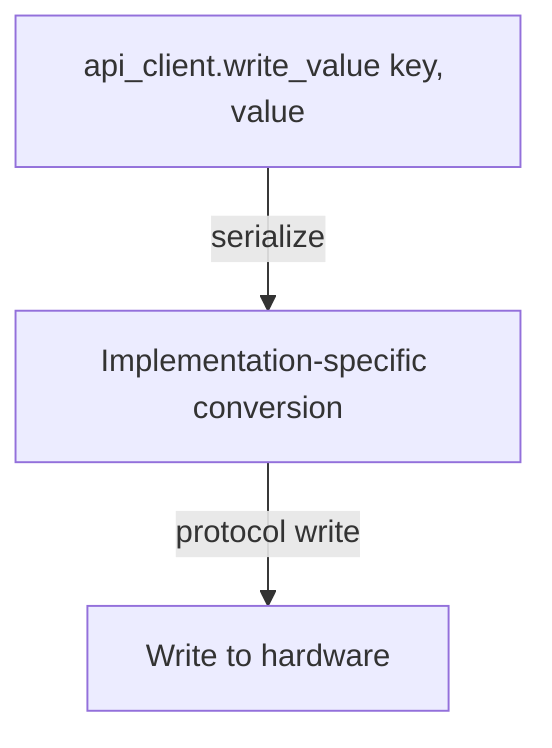

# API Layer & Data Keys

## Overview

The API layer sits between the hardware and the rest of the integration. It
exposes abstract **string keys** (e.g. `"outdoor_temp"`, `"unit_power"`) so that
the coordinator and entities never deal with protocol-specific details. How
those keys are resolved — Modbus registers, a future REST endpoint, or anything
else — is an implementation concern hidden behind the `HitachiApiClient` port.

## API Abstraction

### The Port: `HitachiApiClient`

Defined in `api/base.py`, this abstract class is the contract every gateway
client must implement. Key surface area:

| Area | Methods / Properties |
| --- | --- |
| Connection | `connect()`, `close()`, `connected` |
| Reading | `read_value(key)`, `read_values(keys)` |
| Writing | `write_value(key, value)` |
| Feature detection | `has_dhw`, `has_pool`, `has_circuit(circuit_id, mode)` |
| Status flags | `is_defrosting`, `is_compressor_running`, `is_boiler_active`, ... |
| Unit control | `get/set_unit_power()`, `get/set_unit_mode()` |
| Circuit control | `get/set_circuit_target_temperature(circuit_id)`, ... |
| DHW / Pool control | `get/set_dhw_target_temperature()`, ... |

Entities interact with the coordinator and the API client through these
abstractions — they never import from `api/modbus/`.

### Data Keys

A **data key** is a human-readable string that identifies a value the API can
provide (e.g. `"outdoor_temp"`, `"compressor_frequency"`). Keys are grouped by
device:

| Group | Device | Example keys |
| --- | --- | --- |
| Gateway | Gateway module | `alarm_code`, `unit_model`, `system_config` |
| Control unit | Main heat pump | `outdoor_temp`, `water_inlet_temp`, `unit_power` |
| Primary compressor | Compressor #1 | `compressor_frequency`, `compressor_current` |
| Secondary compressor | Compressor #2 (S80) | `secondary_compressor_frequency` |
| Circuit 1 / 2 | Heating/cooling zones | `circuit1_power`, `circuit1_target_temp` |
| DHW | Domestic hot water | `dhw_power`, `dhw_current_temp` |
| Pool | Pool heating | `pool_power`, `pool_current_temp` |

## Data Flow

### Reading (hardware → entity)



Entity descriptions reference a key with a `value_fn` lambda:

```python
HitachiYutakiSensorEntityDescription(
    key="outdoor_temp",
    value_fn=lambda coordinator: coordinator.data.get("outdoor_temp"),
    # ...
)
```

### Writing (entity → hardware)



The API client validates that the key is writable before attempting the write.

## Modbus Implementation

The current (and only) implementation uses Modbus TCP via pymodbus. All
Modbus-specific concerns live in `api/modbus/`.

### RegisterDefinition

Every data key is backed by a `RegisterDefinition` (defined in
`api/modbus/registers/__init__.py`):

```python
@dataclass
class RegisterDefinition:
    address: int                                    # Read address
    deserializer: Callable[[Any], Any] | None = None  # Raw value -> Python value
    serializer: Callable[[Any], Any] | None = None    # Python value -> raw value (for writes)
    write_address: int | None = None                  # Write address if different from read
    fallback: RegisterDefinition | None = None        # Fallback register if primary returns None
```

- `deserializer` — applied after reading the raw 16-bit register value.
- `serializer` — applied before writing a value back.
- `write_address` — used when the read and write addresses differ (HC-A(16/64)MB
  gateway).
- `fallback` — an alternative register tried when the primary returns `None`
  (e.g. sensor error `0xFFFF`).

### CONTROL vs STATUS Registers

Hitachi gateways expose two logical register ranges:

- **CONTROL** (R/W) — commands sent to the heat pump.
- **STATUS** (R) — actual state read back from the heat pump.

Register definitions must point to **STATUS addresses for reads**. Reading a
CONTROL register only tells you what was last *commanded*, not the actual
running state. This is handled entirely within the register map files — entity
code does not need to know about this distinction.

### Gateway Register Maps

Each gateway has its own register map implementation:

| Gateway | File | Addressing |
| --- | --- | --- |
| ATW-MBS-02 | `api/modbus/registers/atw_mbs_02.py` | Absolute addresses (1000–1231) |
| HC-A(16/64)MB | `api/modbus/registers/hc_a_mb.py` | Computed: `5000 + (unit_id × 200) + offset` |

Both implement `HitachiRegisterMap` (ABC in `api/modbus/registers/__init__.py`)
which defines register dictionaries, bitmasks for feature detection, and
writable key sets.

### Common Deserializers

| Function | Purpose | Example |
| --- | --- | --- |
| `convert_signed_16bit` | Two's complement for signed values | `0xFF9C` → `-100` |
| `convert_from_tenths` | Divide by 10 | `253` → `25.3` |
| `convert_pressure` | Hundredths of MPa to bar | `510` → `51.0` |
| `deserialize_unit_model` | Model ID to string key | `2` → `"yutaki_s80"` |
| `deserialize_alarm_code` | Alarm code to translation key | `42` → `"alarm_code_42"` |

### Sentinel Values

Certain raw register values have special meaning:

| Raw value | Decimal | Meaning |
| --- | --- | --- |
| `0xFFFF` | 65535 | Sensor not connected or communication error |
| `0xFF81` | -127 (signed) | Temperature sensor disconnected |
| `0xFFBD` | -67 (signed) | DHW temperature sensor disconnected |

Deserializers return `None` for sentinel values, which propagates as an
unavailable entity state in Home Assistant.

### Concrete Examples

Read-only register (ATW-MBS-02):

```python
"outdoor_temp": RegisterDefinition(1091, deserializer=convert_signed_16bit),
```

Writable register with serializer (ATW-MBS-02):

```python
"pool_target_temp": RegisterDefinition(
    1029, deserializer=convert_from_tenths, serializer=lambda v: int(v * 10)
),
```

Writable register with separate read/write addresses (HC-A(16/64)MB):

```python
"unit_power": RegisterDefinition(
    self._addr(100), write_address=self._addr(50)
),
```

Register with fallback:

```python
"water_outlet_temp": RegisterDefinition(
    1200,
    deserializer=convert_signed_16bit,
    fallback=RegisterDefinition(1093, deserializer=convert_signed_16bit),
),
```

## Adding a New Data Point

1. **Find the hardware address** in the gateway documentation
   (see [gateway docs](../gateway/)).

2. **Add a `RegisterDefinition`** to the appropriate `REGISTER_*` dictionary in
   the gateway's register file (`api/modbus/registers/`). Choose the correct
   group based on which device the data belongs to.

3. **Add a deserializer** if the raw value needs conversion. Reuse existing
   functions when possible.

4. **If the data point is writable**: add a serializer if needed, and add the
   key to the `WRITABLE_KEYS` set.

5. **Create an entity description** in the appropriate `entities/<domain>/`
   builder, referencing the key via `coordinator.data.get("key")`. See
   [Adding Entities](adding-entities.md).

6. **If the data point is model-specific**: add the key to the profile's
   `extra_register_keys` list (see [Profiles](profiles.md)).

## Further Reading

- [Gateway hardware documentation](../gateway/) — register addresses and
  footnotes from the manufacturer PDF
- [Profiles](profiles.md) — how model-specific data points are selected
- [Architecture overview](../architecture.md) — hexagonal architecture and
  layer boundaries
