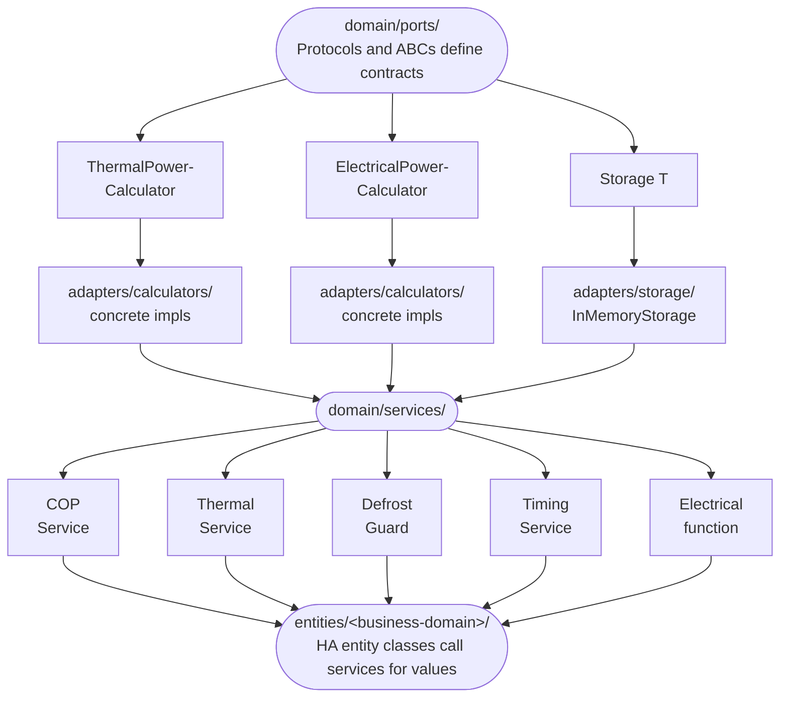

# Domain Services Reference

Domain services contain the pure business logic of the integration. They live in
`custom_components/hitachi_yutaki/domain/services/` and have **zero** Home Assistant
dependencies -- only stdlib imports. This makes them testable without mocks or a
running HA instance. See [Architecture](../architecture.md) for how this layer fits
into the hexagonal design.

---

## COP Calculation

**File:** `domain/services/cop.py`

Computes the Coefficient of Performance by integrating thermal and electrical power
measurements over a sliding time window (default 30 minutes).

### Key classes

| Class | Role |
|---|---|
| `COPService` | Orchestrator -- accepts `COPInput`, delegates to calculators, stores results in the accumulator. |
| `EnergyAccumulator` | Stores `PowerMeasurement` samples and computes COP via trapezoidal integration. |

### Input

`COPInput` carries: water inlet/outlet temperatures, water flow, compressor
current/frequency, optional secondary compressor data, and operation mode.

### Quality levels

| Level | Condition |
|---|---|
| `no_data` | No measurements stored |
| `insufficient_data` | < 5 measurements **or** time span < 5 min |
| `preliminary` | < 15 measurements **or** time span < 15 min |
| `optimal` | >= 15 measurements **and** time span >= 15 min |

### COP formula

```
COP = total_thermal_energy / total_electrical_energy
```

Both energies are computed with trapezoidal integration over the measurement window.
Valid range: 0.5 -- 8.0. Measurements are taken at most once per 60 seconds.

### Dependencies (ports)

`ThermalPowerCalculator` and `ElectricalPowerCalculator` are injected as protocols.
A `Storage[PowerMeasurement]` backend holds the sliding window.

---

## Thermal Energy

**Directory:** `domain/services/thermal/`

Tracks real-time thermal power and accumulates energy for both heating and cooling,
keeping them strictly separated.

### Key classes

| Class | Role |
|---|---|
| `ThermalPowerService` | Entry point -- validates inputs, calls calculators, delegates to accumulator. |
| `ThermalEnergyAccumulator` | Maintains daily and total energy counters for heating and cooling independently. |

### Heating vs cooling separation

The sign of the water temperature delta determines the mode:

- **Heating:** outlet > inlet (positive delta T)
- **Cooling:** outlet < inlet (negative delta T)

DHW and pool modes are **always** classified as heating, regardless of delta T. This
prevents transient negative deltas during mode switches from being counted as cooling.

### Thermal power formula

```
Q = flow_kg_per_s * 4.185 * delta_T
```

Where `flow_kg_per_s = water_flow_m3h * 0.277778` and `delta_T = outlet - inlet`.
Functions `calculate_thermal_power_heating` and `calculate_thermal_power_cooling`
return the positive magnitude for their respective mode, or zero.

### Post-cycle lock

After the compressor stops, thermal inertia keeps delta T non-zero for a while.
The accumulator activates a **post-cycle lock** once the power in the last active
mode drops to zero. While locked, power for that mode is forced to zero. The lock
releases when the compressor restarts.

### Energy counters

- **Daily energy** -- resets automatically at midnight (date change detection).
- **Total energy** -- persistent across HA restarts via restore methods.
- Integration uses trapezoidal averaging between consecutive measurements.

---

## Defrost Guard

**File:** `domain/services/defrost_guard.py`

Filters out unreliable sensor data during heat pump defrost cycles so that COP
and thermal calculations are not polluted by inverted temperature readings.

### State machine

```
NORMAL ──(is_defrosting=True)──> DEFROST
DEFROST ──(is_defrosting=False)──> RECOVERY
RECOVERY ──(stable readings)──> NORMAL
RECOVERY ──(is_defrosting=True)──> DEFROST   (defrost restarts)
```

### Recovery exit conditions

The guard leaves RECOVERY and returns to NORMAL when **either**:

1. **Stable readings** -- 3 consecutive readings where delta T sign matches the
   pre-defrost sign (with a 0.5 C deadband), or
2. **Timeout** -- 5 minutes (300 s) elapsed since entering RECOVERY.

### Usage

```python
guard.update(is_defrosting=True, delta_t=current_delta_t)
if guard.is_data_reliable:
    # safe to feed data into COP / thermal services
```

---

## Compressor Timing

**File:** `domain/services/timing.py`

Tracks compressor on/off transitions and derives average cycle, runtime, and rest
durations for diagnostics.

### Key classes

| Class | Role |
|---|---|
| `CompressorTimingService` | Accepts compressor frequency updates and delegates to history. |
| `CompressorHistory` | Records state transitions, computes averages from the last N events. |

### Output

`CompressorTimingResult` with three optional fields (all in minutes):

- `cycle_time` -- average full cycle (on + off)
- `runtime` -- average compressor on duration
- `resttime` -- average compressor off duration

Historical states can be preloaded from the Recorder for continuity across restarts.

---

## Refrigerant Anomaly Detection

**File:** `domain/services/refrigerant.py`

Continuously detects the early signature of a **slow refrigerant charge loss**. Advisory
only — complements, does not replace, the mandatory F-Gas leak-tightness inspection. Full
rationale and user-facing behaviour: [Refrigerant monitoring](refrigerant-monitoring.md).

### Key class

| Class | Role |
|---|---|
| `RefrigerantMonitor` | Gates and reduces per-poll signals into one robust daily aggregate, freezes a baseline, and classifies drift against it. |

### Signals and superheat

Suction superheat `SH = Tg − Te` (`compressor_tg_gas_temp` −
`compressor_te_evaporator_temp`), outdoor expansion-valve opening `EVO`, evaporating
temperature `Te` and outdoor temperature. Gated on `supports_extended_compressor_sensors`
(needs `Tg`/`EVO`; excludes the Yutampo R32).

### States

| Level | Condition |
|---|---|
| `learning` | Fewer than `BASELINE_DAYS` (14) valid days — baseline not frozen |
| `ok` | Baseline frozen, no significant drift |
| `watch` | Superheat drift ≥ `SUPERHEAT_WATCH_K` from baseline |
| `alert` | Superheat ≥ `SUPERHEAT_ALERT_K` **and** temperature-matched EVO ≥ `EVO_ALERT_PCT` |

### Design notes

- **Daily aggregation:** samples (gated on heating mode, defrost-guard reliability, a steady
  frequency band, plausibility and a 60 s throttle) are reduced to one median-per-day
  `DailyAggregate`, held in an injected `Storage[DailyAggregate]` bounded to `HISTORY_DAYS`.
- **Seasonality:** superheat is a *regulated* quantity (robust to weather) and is the
  primary signal; `EVO` is compared only across days within `TEMP_MATCH_K` of the baseline
  outdoor temperature; `Te` is informational.
- **Persistence:** `serialize()`/`restore()` round-trip the baseline, aggregates and alert
  streak; the adapter persists them via a Home Assistant `Store`. `restore()` validates the
  full payload before touching any state: a malformed snapshot raises `ValueError` and leaves
  the monitor unchanged (atomic restore), so a corrupt `Store` file can never half-load.
  `reset()` clears everything (exposed as the reset button).
- **Time:** like COP, uses `time()` for the throttle and accepts an optional `timestamp` for
  replay/tests.

---

## Electrical Power

**File:** `domain/services/electrical.py`

Estimates electrical power consumption from compressor current with a priority
chain for input data.

> **Scope:** when no measured power is available, the estimate covers the
> **compressor only**. It does not account for the electric backup/immersion
> heater, circulation pumps, fan, or standby loads, and assumes a fixed
> `cos(phi) = 0.9` and default voltage. On Yutampo/DHW-only units, where the
> electric heater carries much of the load, this can under-report by an order of
> magnitude. A configured `measured_power` (Power Sensor option) bypasses the
> estimate entirely (priority 1).

### Priority

1. `measured_power` (direct kW reading, if available)
2. `voltage * current` (measured voltage from Modbus)
3. Default voltage (400 V three-phase / 230 V single-phase)

### Formulas

```
Three-phase:  P = V * I * cos(phi) * sqrt(3) / 1000   [kW]
Single-phase: P = V * I * cos(phi) / 1000              [kW]
```

Constants: `cos(phi) = 0.9`, `sqrt(3) = 1.732`.

---

## Ports

**Directory:** `domain/ports/`

Ports define the contracts that adapters must implement. All are Python Protocols
or abstract base classes.

### ThermalPowerCalculator

```python
class ThermalPowerCalculator(Protocol):
    def __call__(self, inlet: float, outlet: float, flow: float) -> float: ...
```

### ElectricalPowerCalculator

```python
class ElectricalPowerCalculator(Protocol):
    def __call__(self, current: float) -> float: ...
```

### DataProvider

```python
class DataProvider(Protocol):
    def get_water_inlet_temp(self) -> float | None: ...
    def get_water_outlet_temp(self) -> float | None: ...
    def get_water_flow(self) -> float | None: ...
    def get_compressor_current(self) -> float | None: ...
    def get_compressor_frequency(self) -> float | None: ...
    def get_secondary_compressor_current(self) -> float | None: ...
    def get_secondary_compressor_frequency(self) -> float | None: ...
```

### StateProvider

```python
class StateProvider(Protocol):
    def get_float_from_entity(self, config_key: str) -> float | None: ...
```

### Storage\[T\]

```python
class Storage[T](ABC):
    def append(self, item: T) -> None: ...
    def popleft(self) -> T: ...
    def get_all(self) -> list[T]: ...
    def __len__(self) -> int: ...
```

---

## Integration Diagram



Domain services receive their dependencies through constructor injection. Adapters
implement the port protocols and are wired at setup time. Entity classes consume
service outputs but never contain business logic themselves.
